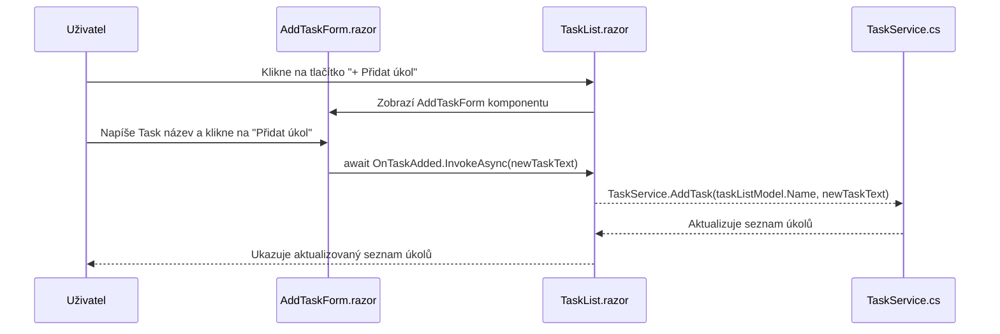

# Blazor

```mermaid
sequenceDiagram
    participant User as Uživatel
    participant AddTaskForm as AddTaskForm.razor
    participant TaskList as TaskList.razor
    participant TaskService as TaskService.cs

    User->>TaskList: Klikne na tlačítko "+ Přidat úkol"
    TaskList->>AddTaskForm: Zobrazí AddTaskForm komponentu
    User->>AddTaskForm: Napíše Task název a klikne na "Přidat úkol"
    AddTaskForm->>TaskList: await OnTaskAdded.InvokeAsync(newTaskText);
    TaskList-->>TaskService: TaskService.AddTask(taskListModel.Name, newTaskText);
    TaskService-->>TaskList: Aktualizuje seznam úkolů
    TaskList-->>User: Ukazuje aktualizovaný seznam úkolů
```
