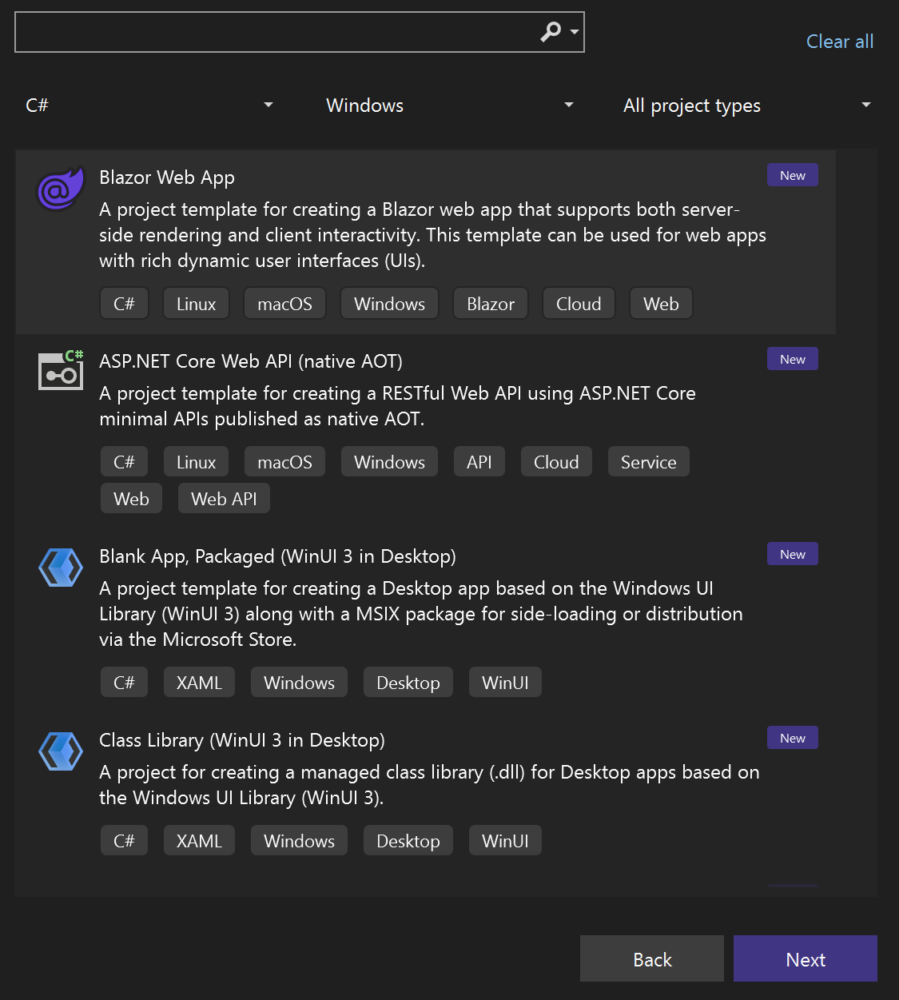
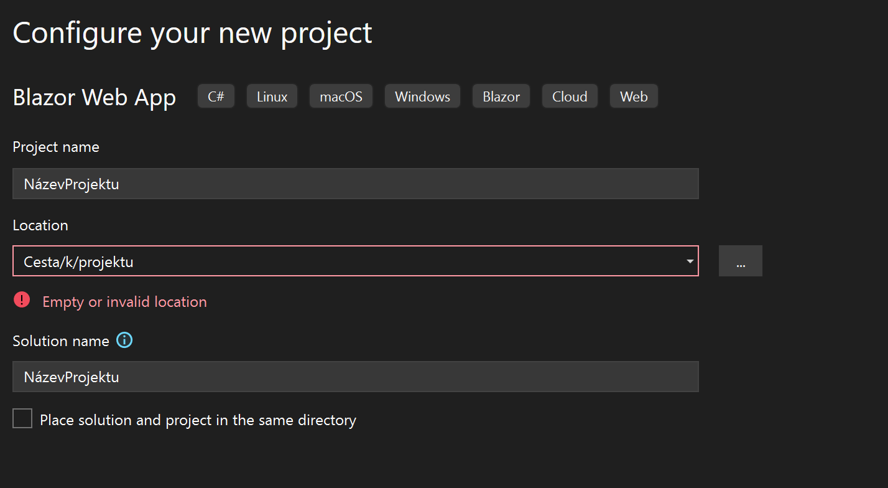
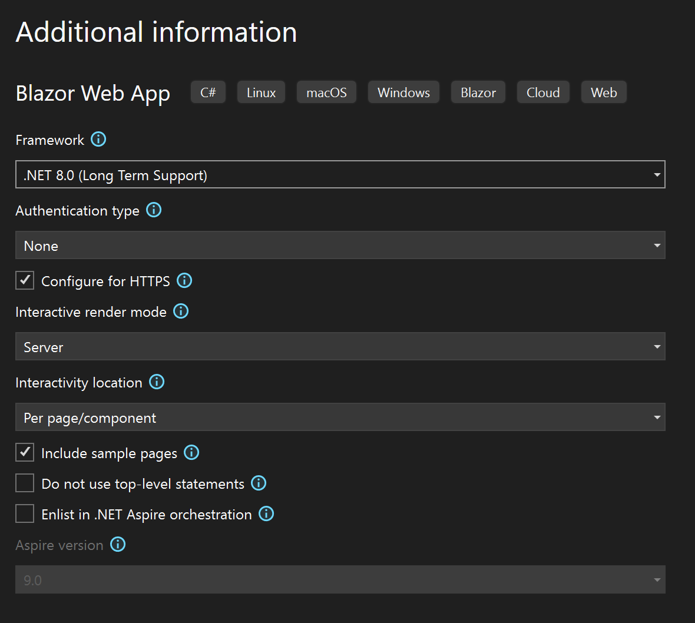
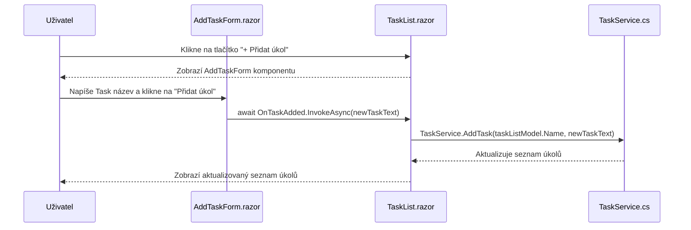

**Blazor**

Projekt pro předmět GUI zaměřený .NET Blazor

# Založení projektu pomocí CMD
```
    dotnet new blazor -n [název_projektu] -f net8.0
```
# Založení pomocí Visual studia
* Výběr templatu


* Tvorba projektu


* Technická specifika projektu


---

# Blazor TODO Aplikace

Tato aplikace je jednoduchý **TODO seznam** vytvořený v Blazor Server. Umožňuje uživateli přidávat, upravovat, mazat a přesouvat úkoly mezi seznamy.

## Jak spustit projekt
1. Naklonuj repozitář:
```bash
git clone https://github.com/ValdemarPospisil/Blazor.git
cd Blazor/
```
2. Spusť Blazor Server aplikaci:
```bash
dotnet watch run
```
3. Otevři v prohlížeči *http://localhost:5000*

---

## Funkcionalita
- Přidání nového úkolu
- Přidání nového seznamu úkolů
- Úprava úkolu (název, popis, termín)
- Odstranění úkolu
- Přesouvání úkolů mezi seznamy
- Dynamické rozhraní s [Blazor Bootstrap](https://demos.blazorbootstrap.com/buttons)

---

## Struktura projektu

```plaintext
/Blazor
│── /Components       # UI komponenty a stránky aplikace
│   ├── /Layout       # Rozvržení aplikace
│   │   ├── MainLayout.razor
│   │   ├── NavMenu.razor
│   ├── /Pages        # Stránky aplikace
│   │   ├── Home.razor        # Hlavní stránka
│   │   ├── Todo.razor        # Stránka s Todo aplikací
│   ├── /Shared       # Sdílené komponenty
│   │   ├── TaskItem.razor        # Komponenta pro jednotlivý úkol
│   │   ├── TaskList.razor        # Komponenta pro seznam úkolů
│   │   ├── AddTaskForm.razor     # Komponenta pro přidání úkolu
│   │   ├── TaskItemDetails.razor # Sidebar s detaily úkolu
│   ├── _Imports.razor  # Globální importy Razor komponent
│   ├── App.razor       # Root aplikace
│   ├── Routes.razor    # Definice routování
│── /Data              # Ukládání a správa dat
│   ├── tasks.json     # JSON soubor s uloženými úkoly
│── /Models            # Datové modely
│   ├── TaskListModel.cs  # Model pro seznam úkolů 
│   ├── TaskModel.cs      # Model pro jednotlivý úkol
│── /Services          # Aplikační logika a služby
│   ├── TaskService.cs # Správa úkolů (přidávání, mazání, přesouvání)
│── /wwwroot           # Statické soubory (CSS, obrázky)
│   ├── styles.css     # Vlastní styly aplikace
│── appsettings.Development.json  # Nastavení pro vývoj
│── appsettings.json               # Konfigurace aplikace
│── BlazorDemo.csproj    # Projektový soubor
│── Program.cs           # Hlavní vstupní bod aplikace
│── Blazor.sln           # Solution soubor

```

---

## Sekvenční diagram



---


## Ukázky kódu pro přidání seznamu úkolů

### 1. Komponenta AddTaskListForm.razor (Formulář pro přidání seznamu úkolů)


#### 🔹 Co dělá?
 -  Tato komponenta umožňuje uživateli vytvořit nový seznam úkolů. Obsahuje input pole pro zadání názvu seznamu a tlačítko pro potvrzení.
#### Rozbor kódu

#### 🔹 Vstupní pole a tlačítko

```razor
<input @bind="newTaskListName" placeholder="Zadejte název seznamu" @bind:event="oninput" @onkeypress="HandleKeyPress" />
<Button @onclick="AddTaskList" Color="ButtonColor.Primary">Přidat seznam</Button>
```
 - `@bind="newTaskListName"` → Obousměrné datové vazby, propojuje vstupní pole s proměnnou `newTaskListName`.
 - `@bind:event="oninput"` → Aktualizuje hodnotu při každém zadání textu.
 - `@onkeypress="HandleKeyPress"` → Pokud uživatel stiskne Enter, spustí se metoda `AddTaskList()`.
 - Tlačítko `@onclick="AddTaskList"` → Po kliknutí zavolá metodu `AddTaskList()`.

#### 🔹 Ošetření chyb
```razor
@if (!string.IsNullOrEmpty(errorMessage))
{
    <p class="error">@errorMessage</p>
}
```
- Pokud je `errorMessage` vyplněna, zobrazí se chybová zpráva.

#### 🔹 Metoda `AddTaskList()`

```razor
private async Task AddTaskList()
{
    if (string.IsNullOrWhiteSpace(newTaskListName))
    {
        errorMessage = "Název seznamu nemůže být prázdný.";
        return;
    }

    if (ExistingTaskLists.Any(tl => tl.Name.Equals(newTaskListName, StringComparison.OrdinalIgnoreCase)))
    {
        errorMessage = $"Seznam '{newTaskListName}' již existuje!";
        return;
    }

    await OnTaskListAdded.InvokeAsync(newTaskListName);
    newTaskListName = string.Empty;
    errorMessage = null; // Resetujeme chybu
}
```
 - Kontroluje, jestli je název seznamu vyplněn.
 - Porovnává názvy seznamů (aby nedošlo k duplicitě).
 - Vyvolá událost `OnTaskListAdded`, která předá nový název seznamu rodičovské komponentě.
 - Resetuje hodnoty (`newTaskListName` a `errorMessage`).

#### 🔹 Reakce na stisknutí Enter
```razor
private async Task HandleKeyPress(KeyboardEventArgs e)
{
    if (e.Key == "Enter")
    {
        await AddTaskList();
    }
}
```
 - Pokud uživatel stiskne Enter, zavolá se metoda `AddTaskList()`.

### 2. Komponenta Todo.razor (Hlavní stránka s Todo seznamy)
*🔹 Co dělá?*
 - Spravuje zobrazení seznamů úkolů a umožňuje přidání nového seznamu.
### Rozbor kódu
 *- Podmíněné zobrazení formuláře*
```razor
@if (showAddTaskListInput)
{
    <AddTaskListForm OnTaskListAdded="HandleTaskListAdded" ExistingTaskLists="@GetTaskLists()" />
}
else
{
    <Button @onclick="ShowAddTaskListInput" 
            Color="ButtonColor.Primary" 
            Size="ButtonSize.Medium"
            Class="w-100 d-flex align-items-center justify-content-center">
        <Icon Name="IconName.Plus" Class="me-2" /> Přidat seznam
    </Button>
}
```
- Pokud `showAddTaskListInput` je true, zobrazí se `AddTaskListForm`.
- Jinak se zobrazí tlačítko Přidat seznam, které zavolá `ShowAddTaskListInput()`.


*🔹 Zpracování události přidání seznamu*

```csharp
private void HandleTaskListAdded(string newTaskListName)
{
    TaskService.AddTaskList(newTaskListName);
    HideAddTaskListInput();
}
```
 - Zavolá `TaskService.AddTaskList()`, který přidá nový seznam úkolů.
 - Skryje vstupní formulář.

### 3. TaskService.cs (Správa seznamů úkolů a úkolů)
*🔹 Co dělá?*
- Spravuje logiku přidávání seznamů úkolů.

*Rozbor kódu*

*🔹 Uložení seznamů úkolů*
```csharp
private List<TaskListModel> taskLists = new List<TaskListModel>();
```
 - Uchovává všechny seznamy úkolů v aplikaci.

*🔹 Přidání nového seznamu úkolů*
```csharp
public void AddTaskList(string name)
{
    taskLists.Add(new TaskListModel { Name = name });
}
```
- Vytvoří nový `TaskListModel` se zadaným názvem a přidá ho do seznamu `taskLists`.

---

# Cvičení 1: Jednoduchý poznámkový blok

### Zadání
Vytvoř novou Blazor stránku, která umožní uživateli:
1. **Přidat** novou poznámku.
2. **Smazat** existující poznámku.
3. **Upravit** existující poznámku.


<details>
  <summary>💡 Nápověda</summary>

- Použij **`@bind`** k obousměrnému svázání vstupu.
- Ulož poznámky do **`List<string>`** a vykresli je pomocí **`@foreach`**.

</details>
