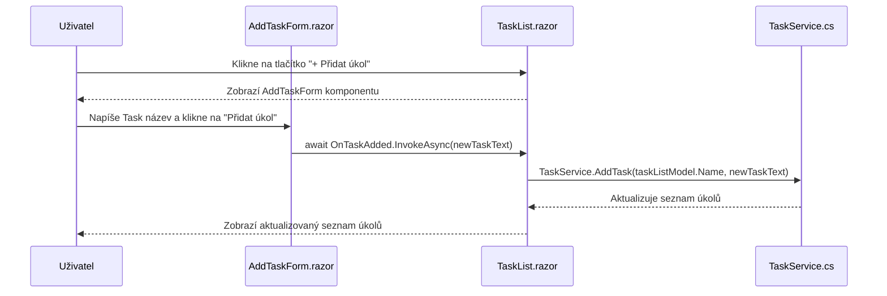

**Blazor**

Projekt pro předmět GUI zaměřený .NET Blazor

# Založení projektu pomocí CMD
```
    dotnet new blazor -n [název_projektu] -f net8.0
```
# Založení pomocí Visual studia
* Výběr templatu


* Tvorba projektu


* Technická specifika projektu


---

# Blazor TODO Aplikace

Tato aplikace je jednoduchý **TODO seznam** vytvořený v Blazor Server. Umožňuje uživateli přidávat, upravovat, mazat a přesouvat úkoly mezi seznamy.

## Jak spustit projekt
1. Naklonuj repozitář:
```bash
git clone https://github.com/ValdemarPospisil/Blazor.git
cd Blazor/
```
2. Spusť Blazor Server aplikaci:
```bash
dotnet watch run
```
3. Otevři v prohlížeči *http://localhost:5000*

---

## Funkcionalita
- Přidání nového úkolu
- Přidání nového seznamu úkolů
- Úprava úkolu (název, popis, termín)
- Odstranění úkolu
- Přesouvání úkolů mezi seznamy
- Dynamické rozhraní s [Blazor Bootstrap](https://demos.blazorbootstrap.com/buttons)

---

## Struktura projektu

```plaintext
/Blazor
│── /Components       # UI komponenty a stránky aplikace
│   ├── /Layout       # Rozvržení aplikace
│   │   ├── MainLayout.razor
│   │   ├── NavMenu.razor
│   ├── /Pages        # Stránky aplikace
│   │   ├── Home.razor        # Hlavní stránka
│   │   ├── Todo.razor        # Stránka s Todo aplikací
│   ├── /Shared       # Sdílené komponenty
│   │   ├── TaskItem.razor        # Komponenta pro jednotlivý úkol
│   │   ├── TaskList.razor        # Komponenta pro seznam úkolů
│   │   ├── AddTaskForm.razor     # Komponenta pro přidání úkolu
│   │   ├── TaskItemDetails.razor # Sidebar s detaily úkolu
│   ├── _Imports.razor  # Globální importy Razor komponent
│   ├── App.razor       # Root aplikace
│   ├── Routes.razor    # Definice routování
│── /Data              # Ukládání a správa dat
│   ├── tasks.json     # JSON soubor s uloženými úkoly
│── /Models            # Datové modely
│   ├── TaskListModel.cs  # Model pro seznam úkolů 
│   ├── TaskModel.cs      # Model pro jednotlivý úkol
│── /Services          # Aplikační logika a služby
│   ├── TaskService.cs # Správa úkolů (přidávání, mazání, přesouvání)
│── /wwwroot           # Statické soubory (CSS, obrázky)
│   ├── styles.css     # Vlastní styly aplikace
│── appsettings.Development.json  # Nastavení pro vývoj
│── appsettings.json               # Konfigurace aplikace
│── BlazorDemo.csproj    # Projektový soubor
│── Program.cs           # Hlavní vstupní bod aplikace
│── Blazor.sln           # Solution soubor

```

---

## Sekvenční diagram



---


## Ukázky kódu pro přidání seznamu úkolů

### 1. Komponenta AddTaskListForm.razor (Formulář pro přidání seznamu úkolů)


#### 🔹 Co dělá?
 -  Tato komponenta umožňuje uživateli vytvořit nový seznam úkolů. Obsahuje input pole pro zadání názvu seznamu a tlačítko pro potvrzení.
#### Rozbor kódu

#### 🔹 Vstupní pole a tlačítko

```razor
<input @bind="newTaskListName" placeholder="Zadejte název seznamu" @bind:event="oninput" @onkeypress="HandleKeyPress" />
<Button @onclick="AddTaskList" Color="ButtonColor.Primary">Přidat seznam</Button>
```
 - `@bind="newTaskListName"` → Obousměrné datové vazby, propojuje vstupní pole s proměnnou `newTaskListName`.
 - `@bind:event="oninput"` → Aktualizuje hodnotu při každém zadání textu.
 - `@onkeypress="HandleKeyPress"` → Pokud uživatel stiskne Enter, spustí se metoda `AddTaskList()`.
 - Tlačítko `@onclick="AddTaskList"` → Po kliknutí zavolá metodu `AddTaskList()`.

#### 🔹 Ošetření chyb
```razor
@if (!string.IsNullOrEmpty(errorMessage))
{
    <p class="error">@errorMessage</p>
}
```
- Pokud je `errorMessage` vyplněna, zobrazí se chybová zpráva.

#### 🔹 Metoda `AddTaskList()`

```razor
private async Task AddTaskList()
{
    if (string.IsNullOrWhiteSpace(newTaskListName))
    {
        errorMessage = "Název seznamu nemůže být prázdný.";
        return;
    }

    if (ExistingTaskLists.Any(tl => tl.Name.Equals(newTaskListName, StringComparison.OrdinalIgnoreCase)))
    {
        errorMessage = $"Seznam '{newTaskListName}' již existuje!";
        return;
    }

    await OnTaskListAdded.InvokeAsync(newTaskListName);
    newTaskListName = string.Empty;
    errorMessage = null; // Resetujeme chybu
}
```
 - Kontroluje, jestli je název seznamu vyplněn.
 - Porovnává názvy seznamů (aby nedošlo k duplicitě).
 - Vyvolá událost `OnTaskListAdded`, která předá nový název seznamu rodičovské komponentě.
 - Resetuje hodnoty (`newTaskListName` a `errorMessage`).

#### 🔹 Reakce na stisknutí Enter
```razor
private async Task HandleKeyPress(KeyboardEventArgs e)
{
    if (e.Key == "Enter")
    {
        await AddTaskList();
    }
}
```
 - Pokud uživatel stiskne Enter, zavolá se metoda `AddTaskList()`.

### 2. Komponenta Todo.razor (Hlavní stránka s Todo seznamy)
*🔹 Co dělá?*
 - Spravuje zobrazení seznamů úkolů a umožňuje přidání nového seznamu.
### Rozbor kódu
 *- Podmíněné zobrazení formuláře*
```razor
@if (showAddTaskListInput)
{
    <AddTaskListForm OnTaskListAdded="HandleTaskListAdded" ExistingTaskLists="@GetTaskLists()" />
}
else
{
    <Button @onclick="ShowAddTaskListInput" 
            Color="ButtonColor.Primary" 
            Size="ButtonSize.Medium"
            Class="w-100 d-flex align-items-center justify-content-center">
        <Icon Name="IconName.Plus" Class="me-2" /> Přidat seznam
    </Button>
}
```
- Pokud `showAddTaskListInput` je true, zobrazí se `AddTaskListForm`.
- Jinak se zobrazí tlačítko Přidat seznam, které zavolá `ShowAddTaskListInput()`.


*🔹 Zpracování události přidání seznamu*

```csharp
private void HandleTaskListAdded(string newTaskListName)
{
    TaskService.AddTaskList(newTaskListName);
    HideAddTaskListInput();
}
```
 - Zavolá `TaskService.AddTaskList()`, který přidá nový seznam úkolů.
 - Skryje vstupní formulář.

### 3. TaskService.cs (Správa seznamů úkolů a úkolů)
*🔹 Co dělá?*
- Spravuje logiku přidávání seznamů úkolů.

*Rozbor kódu*

*🔹 Uložení seznamů úkolů*
```csharp
private List<TaskListModel> taskLists = new List<TaskListModel>();
```
 - Uchovává všechny seznamy úkolů v aplikaci.

*🔹 Přidání nového seznamu úkolů*
```csharp
public void AddTaskList(string name)
{
    taskLists.Add(new TaskListModel { Name = name });
}
```
- Vytvoří nový `TaskListModel` se zadaným názvem a přidá ho do seznamu `taskLists`.

---

# Cvičení 1: Jednoduchý poznámkový blok

### Zadání
Vytvoř novou Blazor stránku, která umožní uživateli:
1. **Přidat** novou poznámku.
2. **Smazat** existující poznámku.
3. **Upravit** existující poznámku.


<details>
  <summary>💡 Nápověda</summary>

- Použij **`@bind`** k obousměrnému svázání vstupu.
- Ulož poznámky do **`List<string>`** a vykresli je pomocí **`@foreach`**.

</details>

---


# Cvičení 2: Galerie obrázků
Vytvoř Blazor stránku, která umožní:
1. **Načíst obrázky**
2. **Vykreslit obrázky**
3. **Prohlédnout konkrétní obrázek**
4. **Klávesové ovládání prohlížení obrázků**
4. **Subúkol**: mansory rozložení pomocí blazoru a čistého css


<details>
  <summary>💡 Nápověda</summary>

- Obrázky načítej pomocí **Service** a vykresluj pomocí cyklu v **HTML** značkách
- Pro otevření obrázku vytvoř overlay přes existující galerii
- pro klávesové ovládání budeš potřebovat registrovat vstupy z klávesnice pomocí **`KeyboardEventArgs`**
</details>

<details>
  <summary>Část řešení</summary>

1. Vytvoříme si razor stránku, kde budeme naší galerii volat
```razor
@page "/gallery"

<h3>Galerie</h3>

<ImageGrid />
```

2. Vytvoříme komponentu `ImageGrid.razor`
    - název je volitelný, ale potřeba upravit i v předešlém kroku

    <details>
        <summary>Kód</summary>

    ```csharp
    @code {
        private List<string> images = new List<string>();
        private int selectedIndex = -1;
        private ElementReference overlayElement;
        private string? path;


        protected override async Task OnInitializedAsync()
        {
            if (path == null)
            {
                images = await ImageService.GetImagePathsAsync("wwwroot/images/gallery");
            }
            else 
            { 
                images = await ImageService.GetImagePathsAsync(path);
            }
        }

        private async Task OpenImage(int index)
        {
            selectedIndex = index;
            StateHasChanged();
            await FocusOverlay();
        }

        private async Task FocusOverlay()
        {
            if (selectedIndex != -1)
            {
                await Task.Delay(50);
                await overlayElement.FocusAsync();
            }
        }

        private void CloseImage()
        {
            selectedIndex = -1;
        }

        private void PreviousImage()
        {
            if (selectedIndex > 0)
            {
                selectedIndex--;
                StateHasChanged();
            }
            else
            {
                selectedIndex = images.Count - 1;
                StateHasChanged();
            }
        }

        private void NextImage()
        {
            if (selectedIndex < images.Count - 1)
            {
                selectedIndex++;
                StateHasChanged();
            }
            else
            {
                selectedIndex = 0;
                StateHasChanged();
            }
        }

        private async Task HandleKeyDown(KeyboardEventArgs e)
        {
            if (selectedIndex != -1)
            {
                if (e.Key == "ArrowLeft")
                {
                    PreviousImage();
                }
                else if (e.Key == "ArrowRight")
                {
                    NextImage();
                }
                else if (e.Key == "Escape")
                {
                    CloseImage();
                }
                await InvokeAsync(StateHasChanged);
            }
        }
    }
    ```
    </details>

    ## Kód je zde trochu delší, ale pojďme si ho rozklíčovat:

    ### `OnInitializedAsync`
    - Spouští se automaticky při inicializaci komponenty.

    ### `OpenImage`
    - Otevře náhled konkrétního obrázku.

    ### `FocusOverlay`
    - Zaostří overlay prvek kvůli ovládání klávesnicí.

    ### `CloseImage`
    - Zavře náhled obrázku (overlay).

    ### `PreviousImage`
    - Posune výběr na předchozí obrázek.

    ### `NextImage`
    - Posune výběr na další obrázek.

    ### `HandleKeyDown`
    - Zpracovává stisknuté klávesy při aktivním overlay.

    ## Stále v naší komponentě udělejme strukturu stránky:


    <details>
        <summary>Kód</summary>


    ```csharp
    @if (images.Count == 0)
    {
        <p>Žádné obrázky nejsou k dispozici.</p>
    }
    else
    {
        <div class="gallery">
            @foreach (var img in images.Select((path, index) => new { path, index })) 
            {
                <div class="gallery-item">
                     OpenImage(img.index)" /> <!-- Creation of individual image and assigning open method -->
                </div>
            }
        </div>
    }

    @if (selectedIndex != -1)
    {
        <div class="gal-overlay" tabindex="0" @onkeydown="HandleKeyDown" @ref="overlayElement">
            <button class="gal-nav-btn left" @onclick="PreviousImage">&#9665;</button>

            

            <button class="gal-nav-btn right" @onclick="NextImage">&#9655;</button>
        </div>
    }
    ``` 
    </details>

    ## Stále v naší komponentě udělejme vzhled stránky:


    <details>
        <summary>Kód</summary>

    ```css
    <style>
        .gallery {
            column-count: 5;
            column-gap: 1rem;
            padding: 1rem;
        }
        @@media (max-width: 1200px) {
            .gallery {
                column-count: 4;
            }
        }

        @@media (max-width: 992px) {
            .gallery {
                column-count: 3;
            }
        }

        @@media (max-width: 768px) {
            .gallery {
                column-count: 2;
            }
        
        }

        .gallery-item {
            break-inside: avoid;
            margin-bottom: 1rem;
            background-color: #f8f8f8;
            border-radius: 0.5rem;
            overflow: hidden;
            box-shadow: 0 2px 8px rgba(0, 0, 0, 0.1);
        }

        .gallery-item img {
            width: 100%;
            display: block;
        }

        .gallery img {
            transition: transform 0.2s;
        }

        .gallery img:hover {
            transform: scale(1.05);
        }

        .gal-overlay {
            position: fixed;
            top: 0;
            left: 0;
            width: 100%;
            height: 100%;
            background: rgba(0, 0, 0, 0.8);
            display: flex;
            align-items: center;
            justify-content: center;
        }

        .gal-overlay img {
            max-width: 80%;
            max-height: 80%;
            border-radius: 10px;
        }

        .gal-nav-btn {
            position: absolute;
            top: 50%;
            transform: translateY(-50%);
            background: rgba(255, 255, 255, 0.5);
            border: none;
            font-size: 24px;
            cursor: pointer;
            padding: 10px;
            border-radius: 50%;
        }

        .gal-nav-btn.left {
            left: 20px;
        }

        .gal-nav-btn.right {
            right: 20px;
        }
    </style>
    ```
    </details>

    ## Stránku máme téměř hotovu, ale nezapoměňme na obrázky:
    - Založíme si ve složce `Services` službu `ImagesService.cs`

    <details>
        <summary>Kód</summary>


    ```csharp

        public class ImageService
        {
            public Task<List<string>> GetImagePathsAsync(string path)
            {
                var images = new List<string>();

                if (Directory.Exists(path))
                {
                    var files = Directory.GetFiles(path, "*.jpg"); 
                    foreach (var file in files)
                    {
                        images.Add($"images/gallery/{Path.GetFileName(file)}");
                    }
                }

                return Task.FromResult(images);
            }
        }
    ```
    - Service najde všechny `.jpg` fotky v dané složce a ukládá jejich cesty do `List<string>`
    </details>

    ## Poslední 2 kroky
    - Aby naše `Service` fungovala jak má je potřeba ji registrivat v `Program.cs` souboru a propojit ji s naší komponentou `ImageGrid.razor`
    ### Registrace:
    ```csharp
    builder.Services.AddSingleton<ImageService>();
    ```
